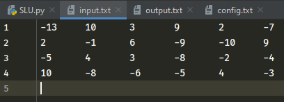
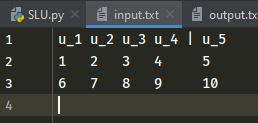

# Простая программа для помощи теха СЛУ

Основная цель программы помочь быстро затехать СЛУ и автоматизировать все расчёты с ней.
Сначала нужно загрузить исходную СЛУ в файл 'input.txt', пример:

В верхней строке можно показать где должен стоять разделитель или задать название столбцов, которое будет в техе:

Теперь можно запускать программу, основные команды для работы с ней:
1) Ручное преобразование СЛУ:
 * (i) +- k(j) - к строке i прибавить/вычесть строку j умноженную на k
 * (i) * (k) - умножить строку i на число k
 * (i) / (k) - разделить строку i на число k (операция выполнится, только если все числа строки i делятся на k)
 * (i)(j) - поменять строку i, j местами
2) Команды для вывода:
* p - напечатать матрицу, по стандарту печатается автоматически после всех преобразований (изменить можно в 'config.txt')
* pt - сохранить все преобразования матрицы в код LaTeX. Сначала он спросит, сколько матриц должно быть на одной строке, а после покажет все преобразования, нужно нажать 'y', чтобы сохранить код этой матрицы.
3) Основные команды
* back - отменить последнее преобразование
* tr - транспонировать СЛУ
* form - привести матрицу к ступенчатому виду
* best form - привести матрицу к улучшенному ступенчатому виду
* shirnk - упростить СЛУ. Делит все строки на максимальное возможное число
* mode - поменять вид преобразований строки/столбцы (не меняет преобразования для form, shrink) (поможет поменять столбцы)
* save - сохранить матрицу в 'input.txt'
* exit - завершить программу
* help - написать все команды

Все промежуточные матрицы сохраняются, они преобразуются в код LaTeX командой pt, код будет в файле 'output.txt'. Дополнительные настройки программы можно поменять в файле 'config.txt', там же можно указать разделитель между матрицами в LaTeX
Пример решения задачи: нужно найти линейно независимые векторы.
В удобном виде записать векторы по сторокам, после чего применить транспонирование 'tr' и сохранить её в input.txt 'save', там же написать название векторов. Снова запустив программу ввести 'form' и матрица будет в ступенчатом виде, смотрим какие векторы линейно независимые, осталось написать 'pt' и выбрать нужные промежуточные матрицы, которые сохранятся в код LaTeX.
